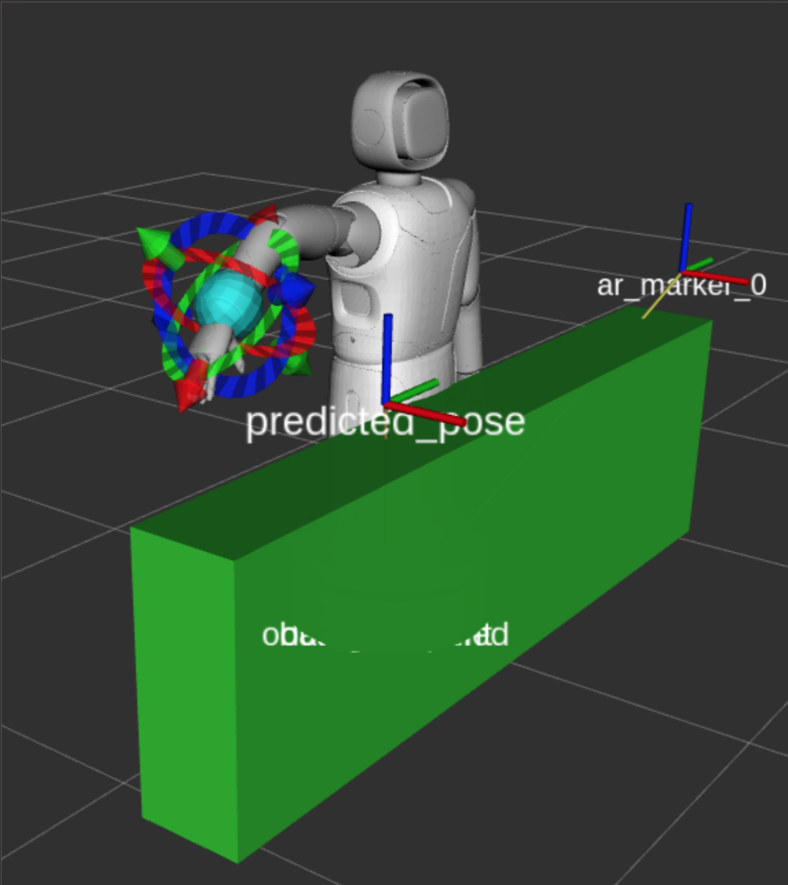
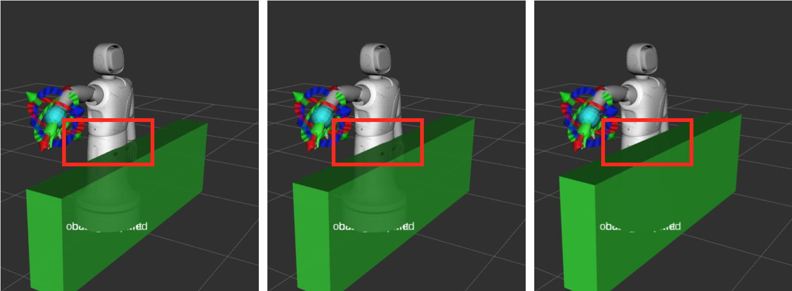
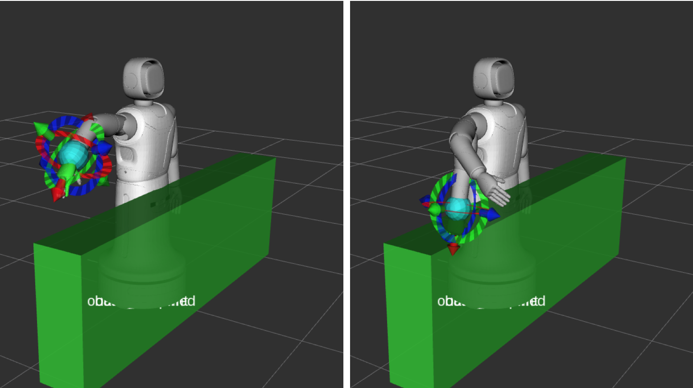

# Statistics

For simulation using moveit's default fake controller.

## Setup

- planning group: right arm
- drop-off configuration: [ -0.0345, -1.4979, 0.1055, -0.7480, 0.2405, 0.017, 0.133 ]
- planner id: arastar.bfs.manip
- SNAP_TO_XYZ_RPY thresh: 0.200
- allowed planning time: 3.0 secs
- height of the grasp pose: conveyor_height + 0.1 m

Fig 1. Experimental setup

## Experiment

Possible criteria for ensuring a good parameter value:

1. large reachable workspace
2. short average planning time
3. short average total time (planning + execution)

Each experiment was performed twice to ensure the correctness.

### 1) Conveyor height

How the conveyor height affects the workspace and planning time.

Experimented heights: 0.66, 0.70, 0.74

Fig 2. (1) height = 0.66; (2) height = 0.70; (3) height = 0.74

#### 1.1) height = 0.66 (z = 0.76)

| predicted grasp pose (x, y, z) | planning time (drop-off -> goal) | total time (goal -> drop-off) | planning time (goal ->drop-off) | total time (goal ->drop-off) |
| :----------------------------: | :------------------------------: | :---------------------------: | :-----------------------------: | :--------------------------: |
|      (0.25, -0.20, 0.76)       |            **FAIL!**             |               -               |                -                |              -               |
|      (0.25, -0.25, 0.76)       |               1.12               |             8.41              |              1.12               |             5.70             |
|      (0.25, -0.30, 0.76)       |               1.34               |             8.29              |              1.10               |             5.39             |
|      (0.25, -0.35, 0.76)       |            **FAIL!**             |               -               |                -                |              -               |
|      (0.25, -0.40, 0.76)       |            **FAIL!**             |               -               |                -                |              -               |
|      (0.25, -0.45, 0.76)       |            **FAIL!**             |               -               |                -                |              -               |

- reachable workspace: [-0.25, -0.30]
- average planning time: 1.17
- average plan+execute time (drop-off to goal): 8.35

#### 1.2) height = 0.70 (z = 0.80)

| predicted grasp pose (x, y, z) | planning time (drop-off -> goal) | total time (goal -> drop-off) | planning time (goal ->drop-off) | total time (goal ->drop-off) |
| :----------------------------: | :------------------------------: | :---------------------------: | :-----------------------------: | :--------------------------: |
|      (0.25, -0.20, 0.80)       |            **FAIL!**             |               -               |                -                |              -               |
|      (0.25, -0.25, 0.80)       |               1.12               |             11.00             |              1.12               |             6.46             |
|      (0.25, -0.30, 0.80)       |               1.37               |             12.30             |              1.12               |             5.14             |
|      (0.25, -0.35, 0.80)       |               2.90               |             16.70             |              1.12               |             5.10             |
|      (0.25, -0.40, 0.80)       |               1.12               |             5.30              |              1.11               |             5.03             |
|      (0.25, -0.45, 0.80)       |               0.20               |             4.15              |              0.12               |             3.50             |
|      (0.25, -0.50, 0.80)       |            **FAIL!**             |               -               |                -                |              -               |

- reachable workspace: [-0.25, -0.45]
- average planning time: 1.34
- average plan+execute time (drop-off to goal): 9.89

#### 1.3) height = 0.74 (z = 0.84)

| predicted grasp pose (x, y, z) | planning time (drop-off -> goal) | total time (goal -> drop-off) | planning time (goal ->drop-off) | total time (goal ->drop-off) |
| :----------------------------: | :------------------------------: | :---------------------------: | :-----------------------------: | :--------------------------: |
|      (0.25, -0.20, 0.84)       |            **FAIL!**             |               -               |                -                |              -               |
|      (0.25, -0.25, 0.84)       |               2.11               |             11.10             |              1.12               |            10.77             |
|      (0.25, -0.30, 0.84)       |               1.13               |           **FAIL!**           |                -                |              -               |
|      (0.25, -0.35, 0.84)       |            **FAIL!**             |               -               |                -                |              -               |
|      (0.25, -0.40, 0.84)       |            **FAIL!**             |               -               |                -                |              -               |
|      (0.25, -0.45, 0.84)       |            **FAIL!**             |               -               |                -                |              -               |
|      (0.25, -0.50, 0.84)       |            **FAIL!**             |               -               |                -                |              -               |

- reachable workspace: small range near y = -0.25
- average planning time: 1.62
- average plan+execute time (drop-off to goal): 11.10

#### 1.4) Results

| Conveyor height (m) | Reachable workspace | Average planning time | Average total time |
| :-----------------: | :-----------------: | :-------------------: | :----------------: |
|        0.66         |   [-0.25, -0.30]    |         1.17          |        8.35        |
|        0.70         |   [-0.25, -0.45]    |         1.34          |        9.89        |
|        0.74         |       [-0.25]       |         1.72          |       11.10        |

- Best height: 0.70 m , it has largest working workspace and reasonable planning times.

### 2) Conveyor speed

How the conveyor speed affects the workspace and planning time.

#### 2.1) Resulst

- Has nothing to do with the planning time, for the planning time depends only on the initial configuration, goal, robot config space and world config space.
- High speeds limit the workspace. If the object is moving fast, it will have moved a longer distance by the time when the arm moves to the predicted pose.

### 3) Home config

Whether to have a home configuration or not. A home configuration is some arm configuration that is set above the conveyor. After the drop-off motion, the robot will first move to the home config and then wait for the next goal. 

- home configuration (joint angles): [ -0.736, -1.052, 0.243, -0.807, 0.2405, 0.017, 0.133 ]
- conveyor height = 0.7 m

Fig 3. without home cinfig (left) v.s. with home config (right)

#### 3.1) with home config

- planning time

| predicted grasp pose (x, y, z) | planning time (home -> goal) | planning time (goal -> drop-off) | planning time (drop-off -> home) |
| :----------------------------: | :--------------------------: | :------------------------------: | :------------------------------: |
|      (0.25, -0.20, 0.80)       |          **FAIL!**           |                -                 |                -                 |
|      (0.25, -0.25, 0.80)       |             1.10             |               1.08               |               0.13               |
|      (0.25, -0.27, 0.80)       |             0.39             |               1.10               |               0.16               |
|      (0.25, -0.30, 0.80)       |             0.12             |               1.11               |               0.16               |
|      (0.25, -0.35, 0.80)       |             0.10             |               1.07               |               0.16               |
|      (0.25, -0.40, 0.80)       |             0.11             |               1.1                |               0.14               |
|      (0.25, -0.45, 0.80)       |             0.08             |               0.14               |               0.16               |
|      (0.25, -0.50, 0.80)       |          **FAIL!**           |                -                 |                -                 |

- total time (plan + execute)

| workspace coordinate y | total time (home -> goal) | total time (goal -> drop-off) | total time (drop-off -> home) |
| :--------------------: | :-----------------------: | :---------------------------: | :---------------------------: |
|         -0.20          |         **FAIL!**         |               -               |               -               |
|         -0.25          |           5.82            |             6.28              |             2.83              |
|         -0.27          |           3.80            |             6.15              |             2.78              |
|         -0.30          |           3.91            |             5.05              |             2.86              |
|         -0.35          |           3.12            |             5.13              |             2.86              |
|         -0.40          |           3.40            |             5.27              |             2.84              |
|         -0.45          |           3.61            |             3.61              |             2.85              |
|         -0.50          |         **FAIL!**         |               -               |               -               |

#### 3.2) without home config

| predicted grasp pose (x, y, z) | planning time (drop-off -> goal) | total time (goal -> drop-off) | planning time (goal ->drop-off) | total time (goal ->drop-off) |
| :----------------------------: | :------------------------------: | :---------------------------: | :-----------------------------: | :--------------------------: |
|      (0.25, -0.20, 0.80)       |            **FAIL!**             |               -               |                -                |              -               |
|      (0.25, -0.25, 0.80)       |               1.12               |             11.00             |              1.12               |             6.46             |
|      (0.25, -0.30, 0.80)       |               1.37               |             12.30             |              1.12               |             5.14             |
|      (0.25, -0.35, 0.80)       |               2.90               |             16.70             |              1.12               |             5.10             |
|      (0.25, -0.40, 0.80)       |               1.12               |             5.30              |              1.11               |             5.03             |
|      (0.25, -0.45, 0.80)       |               0.20               |             4.15              |              0.12               |             3.50             |
|      (0.25, -0.50, 0.80)       |            **FAIL!**             |               -               |                -                |              -               |

#### 3.3) Results

| Home config? | Reachable workspace | Average planning time | Average total time |
| :----------: | :-----------------: | :-------------------: | :----------------: |
|     yes      |   [-0.25, -0.45]    |         0.30          |        3.97        |
|      no      |   [-0.25, -0.45]    |         1.34          |        9.89        |

- With a home config, the planning times to reach goal decrease considerably. And the execution times are not only shorter but also stabler. 

## Conclusion

1. Working conveyor height range: 0.7 m (z = 0.8 m)
3. Conveyor speed doesn't really affect the planner itself. Given the speed, we will be able to calculate how much time left to plan and execute the arm motion.
3. Better to specify a home config (somewhere above the conveyor) to wait for goal before executing grasp.